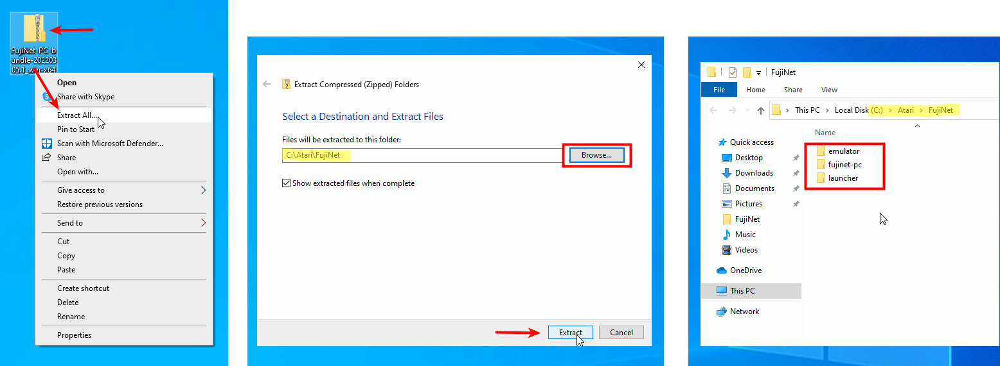
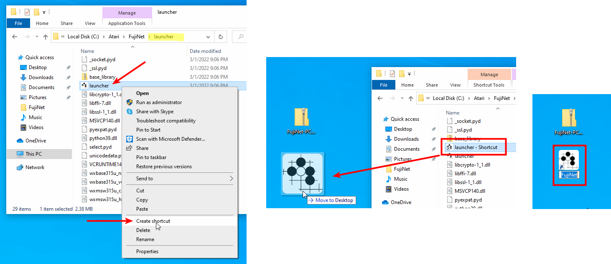
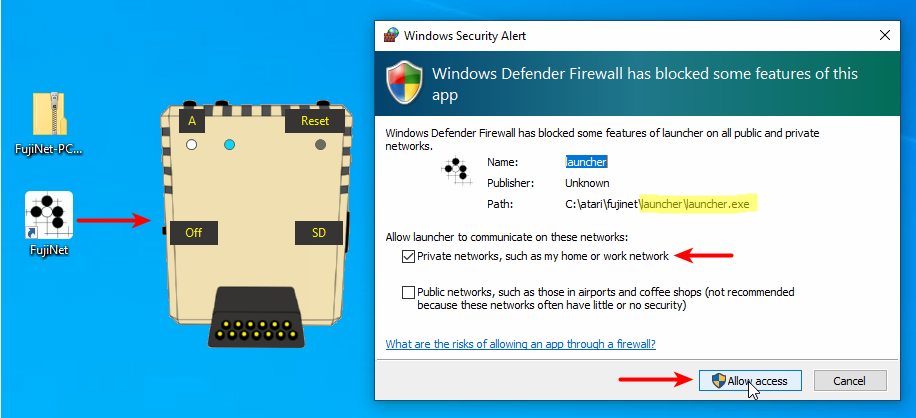
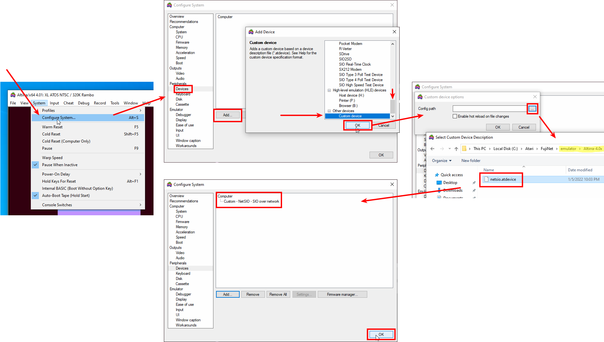
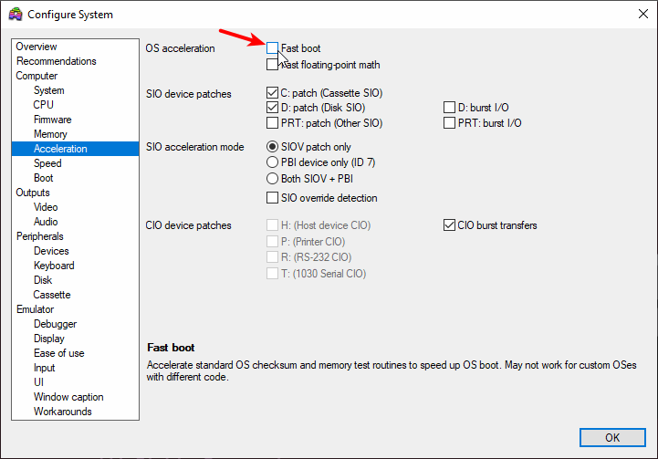
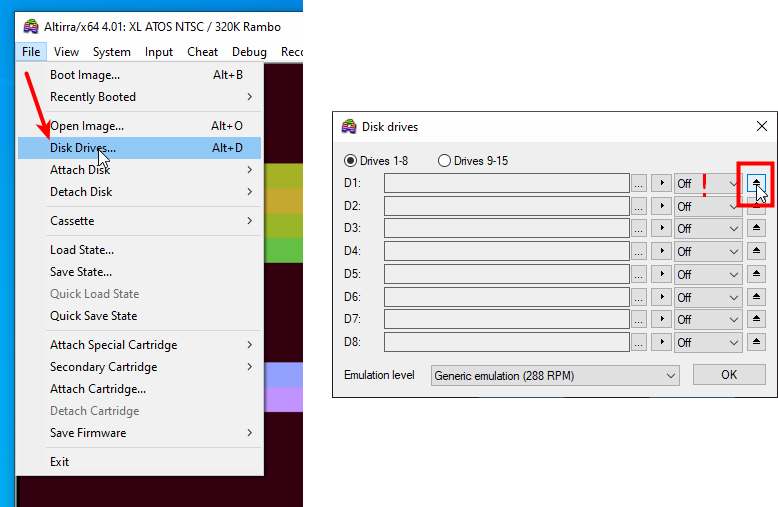
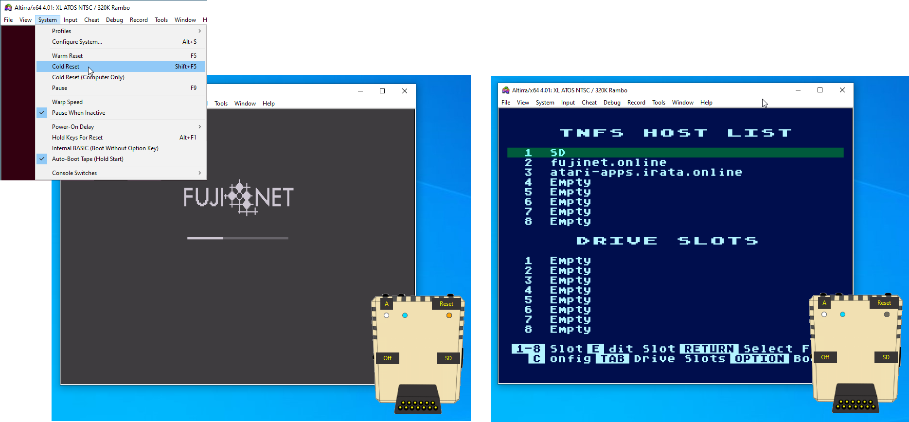
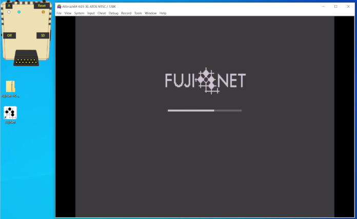

# Installation

FujiNet-PC Launcher is bundled together with Fujinet-PC binaries, NetSIO hub and custom device file for Altirra into one FujiNet-PC **bundle**. Python runtime and necessary libraries are included too.

## Windows

### 1) Get the bundle file and unzip it

[Download](https://github.com/a8jan/fujinet-pc-launcher/releases/latest) the **bundle**. 
Extract the files. Create or use the directory of your choice for extracted files, e.g. `C:\Atari\FujiNet`.

### 2) Create shortcut to launcher.exe

For your convenience create a shortcut to `launcher.exe` and move it to Desktop (or some other place of your choice). Shortcut can be given some nicer name, e.g `FujiNet`.

### 3) Start FujiNet-PC Launcher

Use the shortcut to run FujiNet-PC Launcher.

When started for the first time, the OS may ask for security confirmation.

The Launcher will run FujiNet-PC and NetSIO hub programs in background. The leftmost LED (white) indicates that FujiNet-PC is running. Next LED (blue one) indicates that NetSIO hub is running. The LED on the right (amber) will be active when the SIO communication  occurs.

Similar to real FujiNet use buttons for some basic actions. Right click empty area to open pop-up menu with few more options.

### 4) Connect Altirra with FujiNet

Finally, the two pieces, Altirra and FujiNet, must be connected. For this custom device have to be plugged in to Altirra.

In Altirra, navigate to menu `System` > `Configure System...` In `Configure System` window navigate to `Peripherals` > `Devices` and `Add` custom device. Use `...` button to navigate to `emulator\Altirra` and select `netsio.atdevice` file. Once added, the device will be listed as `NetSIO - SIO over network` custom device.

### 5) Disable Fast boot acceleration

To allow emulated Atari boot from from FujiNet via custom device the Fast boot acceleration feature must be disabled.

### 6) Detach Altirra's D1: drive

To boot from FujiNet (acting as D1:), similar to real Atari, there cannot be multiple D1: drives attached to SIO bus. Detach other D1: if any.

### 7) Boot emulated Atari from FujiNet

To simulate power cycle of both Atari and FujiNet one can use `Cold Reset`. To "power cycle" Atari only use `Cold Reset (Computer Only)`.

## Video ;-)

Video with above steps:

Enjoy!
