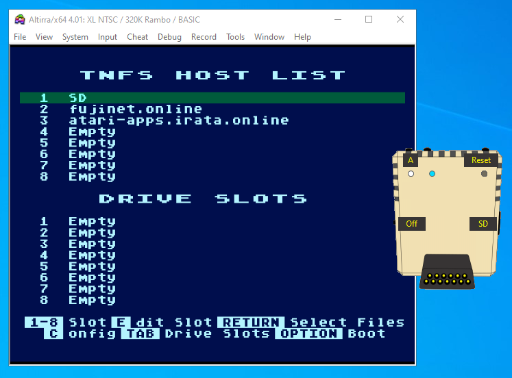
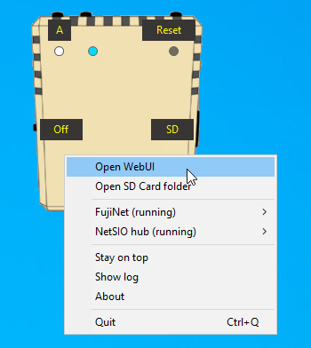

# FujiNet-PC Launcher

Brings [#FujiNet](https://fujinet.online/) experience into [Altirra](https://virtualdub.org/altirra.html) Atari emulator. It is simple launcher GUI to control [FujiNet-PC](https://github.com/FujiNetWIFI/fujinet-pc) and [NetSIO hub](https://github.com/FujiNetWIFI/fujinet-emulator-bridge). 

Written in Python, using wxWidgets for GUI. It can run on Windows, macOS and Linux.

Note: Wine can be used to run Altirra on macOS and Linux.

## What does Fujinet-PC Launcher do?
- FujiNet-PC is launched in background
- NetSIO hub is launched in background to bridge FujiNet into Atari emulator
- Monitors both programs, user can stop them and/or restart them
- Click to open FujiNet-PC "SD Card" folder
- Allows to open FujiNet WebUI in default web browser
- FujiNet logs available via Log window
- Status LED's (FujiNet-PC running, NetSIO hub running, SIO active)
- "A" buton with Disk Swap function
- Command line options to control FujiNet-PC and NetSIO hub
  * parameters to control SD folder, config file, network ports
  * allows multiple Altirra-FujiNet instances to run simultaneously

## Download

**FujiNet-PC bundle** is available in [Releases](https://github.com/a8jan/fujinet-pc-launcher/releases) section. The bundle contains: FujiNet-PC binaries, Launcher GUI, NetSIO hub and NetSIO custom device for Altirra. Python with necessary libraries is part of the bundle. All in one bundle is currently available only for Windows.

Check for setup instructions [here](Install.md).

An alternative to all in one bundle is a variant which includes **scripts** only, also available in [Releases](https://github.com/a8jan/fujinet-pc-launcher/releases) section. The scripts package contains: Launcher GUI and NetSIO hub Python modules and NetSIO custom device for Altirra. It does not contain any binaries. To run scripts Python 3 with necessary libraries must be installed on the system and FujiNet-PC binaries ([downloaded](https://github.com/FujiNetWIFI/fujinet-pc/releases/latest) or [built](https://github.com/FujiNetWIFI/fujinet-pc#build-instructions)) have to be placed into `fujinet-pc` directory.

Check how to run FujiNet-PC Launcher or NetSIO hub as Python scripts [here](ScriptsUsage.md).
