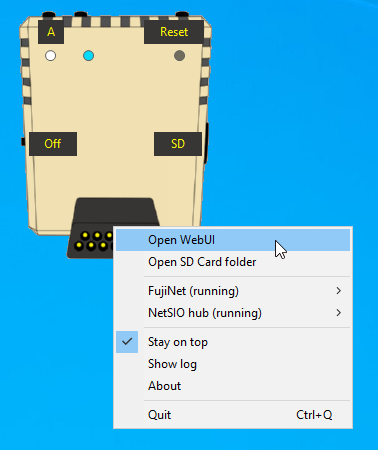
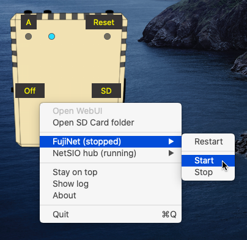

# FujiNet-PC Launcher

Simple launcher GUI to control [FujiNet-PC](https://github.com/FujiNetWIFI/fujinet-pc) and [NetSIO hub](https://github.com/FujiNetWIFI/fujinet-emulator-bridge). Brings #FujiNet experience into [Altirra](https://virtualdub.org/altirra.html) Atari emulator in easy way.

Written in Python, using wxWidgets for GUI. It can run on Windows, macOS and Linux.

## What does Fujinet-PC Launcher do?
- FujiNet-PC is launched in background upon start
- NetSIO hub is launched in background to bridge FujiNet into Atari emulator
- Monitors both programs, user can stop them and/or restart them
- Quick way to navigate to FujiNet-PC "SD Card" folder
- Quick way to open FujiNet WebUI in default web browser
- Live logs are available via Log window
- Status LED's
- Command line options
